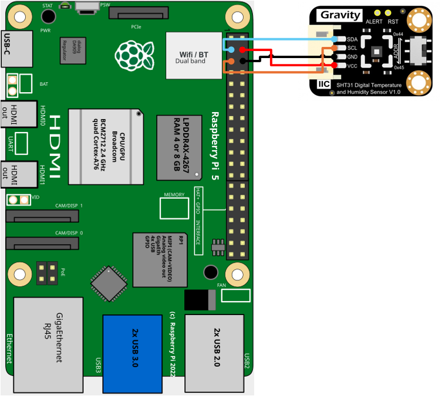

# Composbot_Fijo
## SHT31F
___
El sensor SHT31-F ofrece mediciones precisas de temperatura y humedad con protección IP67, bajo consumo de energía y compatibilidad con I2C para aplicaciones de IoT
___
>[!NOTE]
> 
> Si estas utilizando ubuntu en tu raspberry pi recuerda activar el puerto I2C desde raspi-config
- ### Diagrama de conexión 

| Raspberry pi 5  | SHT31-F |
|---|---|
| PIN3/GPIO2/SDA  | SDA  |
| PIN5/GPIO3/SCL  | SCL  |
| PIN4/5V  | VCC  |
| PIN6/GND  | GND  |

- ### Instalación libreria SHT31
En una terminal ejecuta el siguiente codigo
~~~~
sudo pip3 install adafruit-circuitpython-sht31d
~~~~
Si se presenta este error 