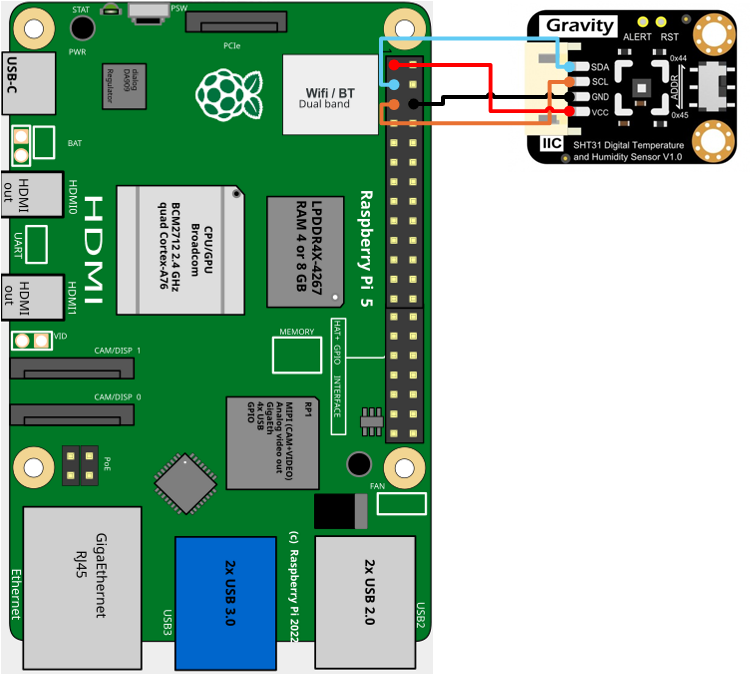
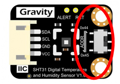

# Composbot_Fijo
## SHT31F
___
El sensor SHT31-F ofrece mediciones precisas de temperatura y humedad con protección IP67, bajo consumo de energía y compatibilidad con I2C para aplicaciones de IoT
___
>[!NOTE]
> 
> Si estas utilizando ubuntu en tu raspberry pi recuerda activar el puerto I2C desde `raspi-config`
- ### Diagrama de conexión 

| Raspberry pi 5  | SHT31-F |
|---|---|
| PIN3/GPIO2/SDA  | SDA  |
| PIN5/GPIO3/SCL  | SCL  |
| PIN4/5V  | VCC  |
| PIN6/GND  | GND  |

- ### Instalación libreria SHT31
En una terminal ejecuta el siguiente codigo
~~~~
sudo pip3 install adafruit-circuitpython-sht31d
~~~~
Si se presenta este error 
~~~~
error: externally-managed-environment

× This environment is externally managed
╰─> To install Python packages system-wide, try apt install
    python3-xyz, where xyz is the package you are trying to
    install.
    
    If you wish to install a non-Debian-packaged Python package,
    create a virtual environment using python3 -m venv path/to/venv.
    Then use path/to/venv/bin/python and path/to/venv/bin/pip. Make
    sure you have python3-full installed.
    
    If you wish to install a non-Debian packaged Python application,
    it may be easiest to use pipx install xyz, which will manage a
    virtual environment for you. Make sure you have pipx installed.
    
    See /usr/share/doc/python3.12/README.venv for more information.

note: If you believe this is a mistake, please contact your Python installation or OS distribution provider. You can override this, at the risk of breaking your Python installation or OS, by passing --break-system-packages.
hint: See PEP 668 for the detailed specification.
~~~~
Esto se debe a que algunas versiones recientes de ubuntu bloquean el uso de pip en el sistema global. 
Las posibles soluciones para este problemas son: 
- Usa entornos virtuales 
- Si el paquete existe utiliza `sudo get install python3-nombre-paquete`
- Fuerza la instalacion con `--break-system-packages`

Si los paquetes están instalados correctamente y la conexion es correcta a ejecutar el script `sht31f.py` deberia mostrar este resultado.
~~~~
Temperature: 22.2 C
Humidity: 48.5 %

Temperature: 22.1 C
Humidity: 48.5 %

Temperature: 22.1 C
Humidity: 48.5 %
~~~~
Si al ejecutar el script ves el siguiente error 
~~~~
ValueError: No I2C device at address: 0x44
~~~~
Revisa el selector de direccion i2c del sensor sht31f que este de acuerdo al que utilizaste en tu script

~~~~
sensor = adafruit_sht31d.SHT31D(i2c, address=0x45) # Direccion i2c del sensor sht31f "0x45 o 0x44"
~~~~
