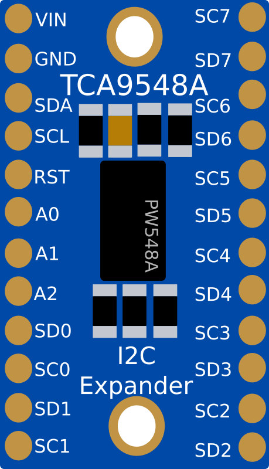
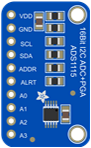
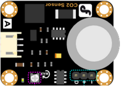
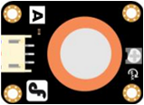
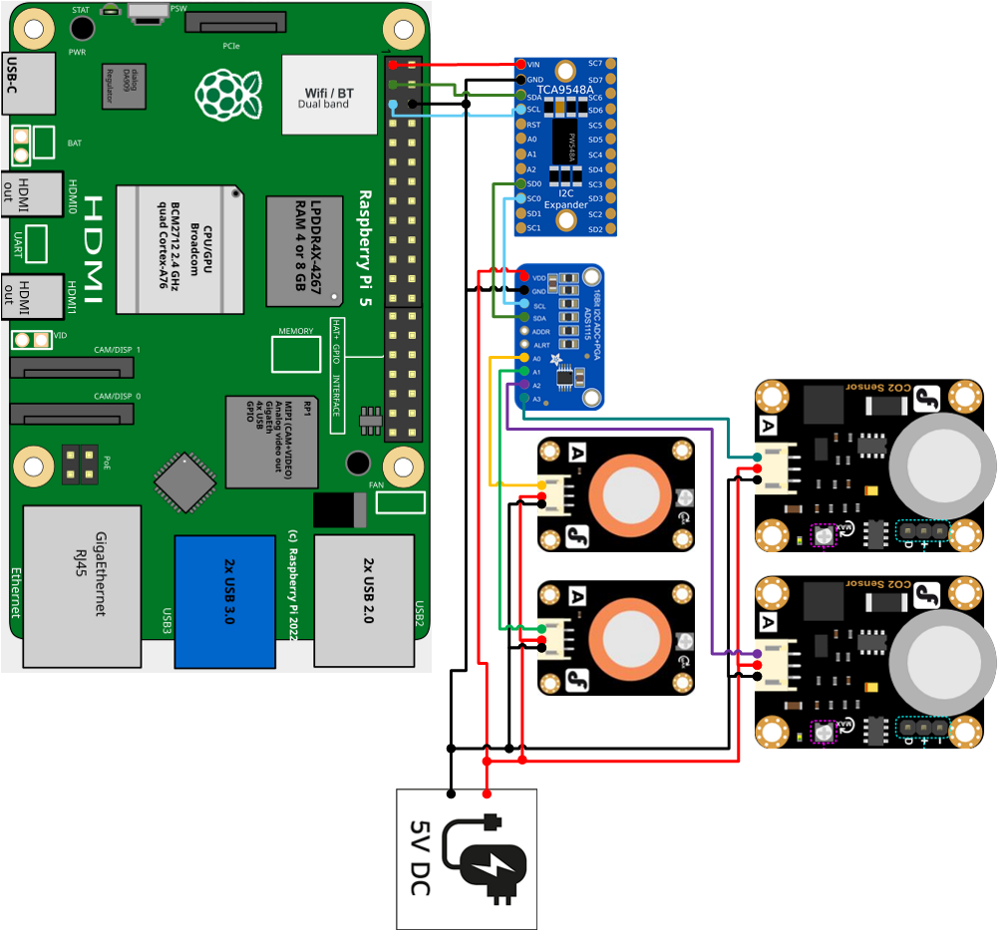

# Composbot Fijo 
## Sensores de Monoxido de Carbono y Metano con RPI5, ADS1115 y TCA9548A
Este repositorio documenta el proceso de conexión e implementación de un sistema de adquisición de datos utilizando una **Raspberry Pi 5 con Ubuntu 24.04**, un multiplexor I2C **TCA9548A**, un convertidor analogico digital **ADS1115**, dos sensores de CO₂ **MG811** y dos sensores de CH₄ **MQ4**

- [Conexion sensores MG811 y MQ4 al ADS1115](#Conexion_sensores)
- [Prueba de funcionamiento del ADS1115]()
- [Conexion ADS1115 al TC9548A]()
- [Prueba de funcionamiento del TCA9548A]()
---
### Conexion sensores
#### TCA9548A
El **TCA9548A** es un extensor I2C de 8 canales, La función de un extensor I2C es conectar varios buses a un único bus. Podría entenderse como un tipo particular de multiplexor, pero especialmente diseñado para comunicación I2C. También pueden ser útiles para comunicar buses I2C con tensiones diferentes, sin necesidad de emplear un adaptador de nivel lógico. Así es posible comunicar buses a tensiones de 1.8V, 2.5V, 3.3V y 5V.

#### ADS1115
El ADS1115 es un convertidor analógico–digital (ADC) de 16 bits. El chip se puede configurar como 4 canales de entrada de un solo extremo o dos canales diferenciales. Como beneficio adicional, incluso incluye un amplificador de ganancia programable, de hasta x16, para ayudar a aumentar señales simples/diferenciales más pequeñas a todo el rango

#### MG811
El módulo tiene un sensor MG-811 que es altamente sensible al CO2 Rango de medición 0～10000 ppm

#### MQ4
El MQ-4 es un sensor electrónico diseñado para detectar gases combustibles como el metano (CH₄) y el gas natural, con una sensibilidad que abarca concentraciones entre 300 y 10,000 partes por millón (ppm).

#### Diagrama de conexión 
En este diagrama se muestra las conexion entre cada uno de los sensores y modulo utilizados. 

[!WARNING]  No conecte el TCA9548A a 5V ya que podria dañar el puerto I2C de la raspberry pi.